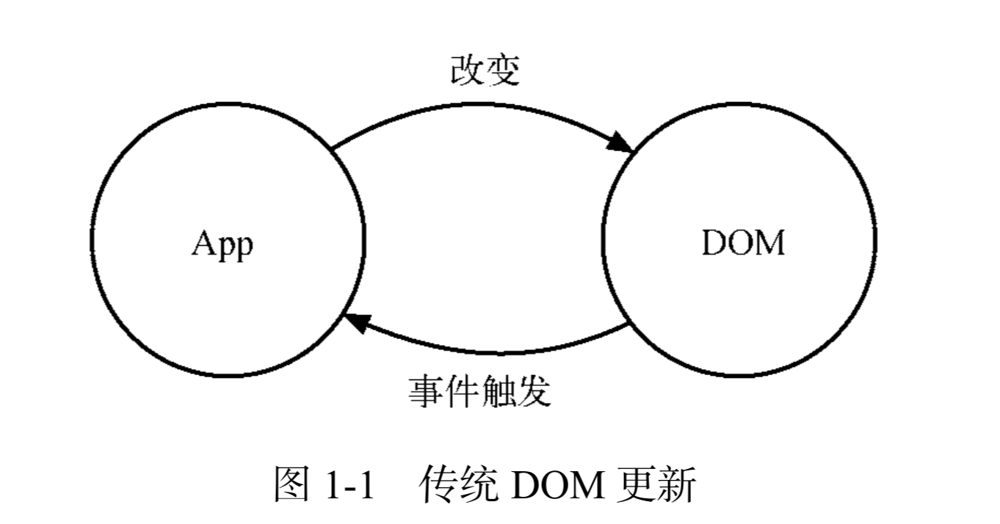
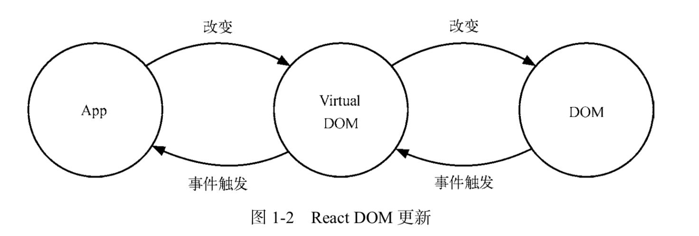

# 一、web 入门 (20分钟)
### 1. 研发流程
### 2. 传统开发模式（HTML + CSS + JavaScript）

(1) HTML（结构）：搭建页面整体结构；
(2) CSS（表现）：加上页面布局、颜色等样式；
(3) JavaScript（行为）：加上页面交互，如根据用户操作做出反馈；

### 3. ES-Module + jQuery

todo: 过渡，问题提出？
### 4. LESS + ES-Module + React
  

# 二、React 工作原理（30分钟）

1. React 几个重要的概念，了解它可以带给我们什么启发
    1. Virtual DOM：一个描述 DOM 信息的对象。React 本身只是一个 DOM 的抽象层，使用组件构建虚拟 DOM；
    2. Diff 算法：对比新旧VDOM之间的差异，达到批量的、最小化的执行dom操作，从而提高性能；
    3. render()：渲染，创建页面DOM元素。JSX代码 => VDOM => 真实的DOM

2. 为什么使用 React
 - MVVM（Model-View-ViewModel）。实现了（ViewModel），数据/业务逻辑（model），与视图层的分离（view）。// data/props => <Views />
 - 组件抽象，组件复用，提高开发效率；
 - Virtual DOM + Diff。DOM 操作非常昂贵，性能消耗最大。React 通过VDOM模型与diff算法，正确渲染页面的同时减少DOM操作；

# 三、模块化

### CommonJS
> 用于 `Node` 服务开发的规范。`Node`应用由模块组成，每个文件就是一个模块；

### AMD（ Asynchronous Module Definition）
> 异步模块定义，用于浏览器模块化开发的一套约定规范，是 `RequireJS` 在推广过程中对模块定义的规范化产出。

### CMD（ Common Module Definition）
> 通用模块定义，用于浏览器模块化开发的一套约定规范，是 `SeaJS` 在推广过程中对模块定义的规范化产出。`CMD`是异步加载，只有在模式被使用时才会被加载； 整合了 `CommonJs` 和 `AMD`的规范特点，传入`requie`,`exports`,`module`三个参数，在定义模块s时，可直接在代码中引入（`require`）其他模块依赖，并且导出（`exports`）当前模块，以供其他模块使用；

### UMD（ Universal Module Definition） = AMD + CommonJS
> 叫做通用模块定义规范，也是前端模块化演变出的一种模块化定义，是模块定义的跨平台解决方案。它支持运行时让同一个代码的模块，在使用 Commonjs、AMD等其他模块化规范项目中运行，换句话说，UMD可以让你的代码兼容基于其他多种模块化规范写的模块，统一浏览器端以及非浏览器端的模块化方案的规范，通用性很强，但本质上他没有自己的“规范”，他其实就是个集合。

